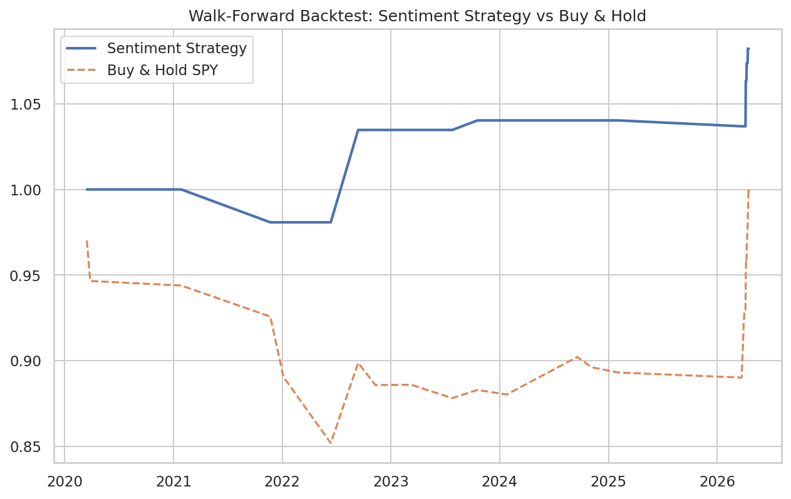

# Financial News Sentiment vs Market Direction

This project analyzes whether **daily financial news sentiment** contains predictive signal for **next‑day equity market direction**, after conditioning on **volatility regimes**.

The focus is **research integrity and interpretability**, not brute‑force optimization.

---

## Dataset
- News sentiment scored via **VADER**
- Source credibility weighting applied
- Market data: SPY, QQQ, DIA
- Volatility proxy: VIX
- Time span: 2020–2026

---

## Methodology
1. Sentiment aggregation and normalization
2. Momentum vs sentiment‑level separation
3. Volatility regime definition
4. Bucket‑based exploratory analysis
5. Regime‑aware walk‑forward backtest
6. Interpretable logistic regression baseline

---

## Results Snapshot

- Sentiment signals are **regime‑dependent**
- Improving sentiment after negativity shows the strongest signal
- Strategy avoids extreme drawdowns during volatility spikes
- Walk‑forward backtest confirms no look‑ahead bias

---

## Key Insights
- Sentiment **levels alone are not predictive**
- **Improving sentiment** after negativity is more informative
- Volatility context is mandatory
- Sentiment works best as a **conditional signal**

---

## Structure
- `data/` — raw and processed datasets  
- `notebooks/` — Kaggle‑ready research notebook  
- `src/` — reusable feature and backtest logic  

---

## Disclaimer
This project is for research and educational purposes only.
